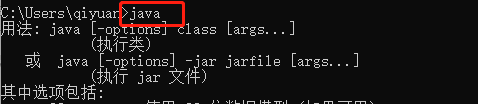

# Maven基础

## 前提：配置好java环境

命令行输入：java、javac、Java -version均正确输出

- java：

   

  

  image20200104122509523.png

- javac：

  

  image20200104122603264.png

- java -version：

  

  image20200104122651586.png

------

## 安装Maven

### 下载Maven bin文件压缩包

[](maven笔记图片/image-20200104120120237-09cc6da3b0be4364acaef1085e7497f4.png)

[image20200104120120237.png](maven笔记图片/image-20200104120120237-09cc6da3b0be4364acaef1085e7497f4.png)


下载后解压放在C:\Program Files\maven文件夹下

### 配置环境变量

1. 新建变量名：M2_HOME

2. 配置变量值：C:\Program Files\maven\apache-maven-3.6.3（刚才解压的文件夹路径，打开后可以看到bin文件夹）

3. 修改path：双击Path，新建一条记录**%M2_HOME%\bin**

   [](maven笔记图片/image-20200104133406810-ee6107fc5c924e68a9a22fbb9f8ed87e.png)

   [image20200104133406810.png](maven笔记图片/image-20200104133406810-ee6107fc5c924e68a9a22fbb9f8ed87e.png)

   

   [](maven笔记图片/image-20200104133507781-5afbfac88fab41b49be3916e917b522d.png)

   [image20200104133507781.png](maven笔记图片/image-20200104133507781-5afbfac88fab41b49be3916e917b522d.png)

   

4. 命令行中输入：mvn -version （验证maven环境安装正确）[](maven笔记图片/image-20200104130110126-63e95782ae5d4f4fa58ce6a9ff894b17.png)

   [image20200104130110126.png](maven笔记图片/image-20200104130110126-63e95782ae5d4f4fa58ce6a9ff894b17.png)

   

### Maven的设置

在下载解压后的文件夹中找到**conf文件夹**下的**settings.xml**文件

右键启用编辑：

- 配置jdk版本

ctrl+F查找**profiles**标签

在该标签下添加以下代码：

```xml
	<profile>    
    <id>jdk-1.8</id>    
    <activation>    
       <activeByDefault>true</activeByDefault>    
       <jdk>1.8</jdk>    
    </activation>    
    <properties>    
       <maven.compiler.source>1.8</maven.compiler.source>    
       <maven.compiler.target>1.8</maven.compiler.target>
       <maven.compiler.compilerVersion>1.8</maven.compiler.compilerVersion>
    </properties>
</profile>
```

XML

Copy

这里是配置Maven下载jdk1.8版本的jar包

- 配置本地仓库

ctrl+F查找**localRepository**标签

```xml
<localRepository>C:\Program Files\maven\repo</localRepository>
```

XML

Copy

完成对**settings.xml**的编辑后保存，并将其复制到**C:\Program Files\maven**路径下

默认下载jar包到C:\Program Files\maven\repo，这个文件夹就是本地仓库

至此Maven已经配置完毕

------

## Maven使用入门

使用入门以一个**Hello Maven!**项目为例

在Maven的世界中最主要的命令是**mvn clean compile**、**mvn clean test** 、**mvn clean install** 、**mvn clean package**

### 编写pom.xml

```xml
<?xml version="1.0" encoding="UTF-8"?>
<projectxmlns="http://maven.apache.org/POM/4.0.0"xmlns:xsi="http://www.w3.org/2001/XMLSchema-instance"xsi:schemaLocation="http://maven.apache.org/POM/4.0.0 http://maven.apache.org/xsd/maven-4.0.0.xsd">
    <modelVersion>4.0.0</modelVersion>
    <groupId>com.codeqi</groupId>
    <artifactId>hellomaven</artifactId>
    <version>1.0-SNAPSHOT</version>
    <name>hello maven</name>
</project>
```

XML

Copy

一般**groupId**为公司名，**artifactId**为项目名，**version**为版本号，**name**表示声明一个对用户友好的项目名称，这个不是必须的

本项目的main文件路径：\hello maven\src\main\java\com\mysql\demo\Main.java

将项目主代码放入**\src\main\java**路径下是遵循Maven约定，Maven会自动搜索该目录找到项目主代码

### 使用Maven编译

- hellomvn代码

```java
package com.codeqi;

public class hellomvn {
    public String returnx(){
        return "Hello Maven";
    }

    public static void main(String[] args) {
        System.out.println(new hellomvn().returnx());
    }
}
```

Java

Copy

代码编写完毕后，在项目根目录下运行命令**mvn clear compile**

[](maven笔记图片/image-20200104144112861-415e064cd6814a2fa5c6b04cdc24ceb3.png)

[image20200104144112861.png](maven笔记图片/image-20200104144112861-415e064cd6814a2fa5c6b04cdc24ceb3.png)


clear表示清除项目的target文件夹，之后将编译好的class文件放入该文件夹中

之后就可以通过编写一些单元测试代码并让Maven进行自动化测试

### 编写测试代码

- 首先为pom.xml文件添加Junit依赖

```xml
<?xml version="1.0" encoding="UTF-8"?>
<projectxmlns="http://maven.apache.org/POM/4.0.0"xmlns:xsi="http://www.w3.org/2001/XMLSchema-instance"xsi:schemaLocation="http://maven.apache.org/POM/4.0.0 http://maven.apache.org/xsd/maven-4.0.0.xsd">
    <modelVersion>4.0.0</modelVersion>
    <groupId>com.codeqi</groupId>
    <artifactId>hellomaven</artifactId>
    <version>1.0-SNAPSHOT</version>
    <dependencies>
        <dependency>
            <groupId>junit</groupId>
            <artifactId>junit</artifactId>
            <version>4.7</version>
            <scope>test</scope>
        </dependency>
    </dependencies>
</project>
```

XML

Copy

- 项目结构

[](maven笔记图片/image-20200105142207596-d2ca220d933f4a9ea89fdf9901c00880.png)

[image20200105142207596.png](maven笔记图片/image-20200105142207596-d2ca220d933f4a9ea89fdf9901c00880.png)


- testhellomvn代码

```java
package com.codeqi;

import org.junit.Test;
import static org.junit.Assert.assertEquals;

public class testhellomvn {
    @Test
    public void testhello(){
        hellomvn hello = new hellomvn();
        String x=hello.returnx();
        assertEquals("Hell9999o Maven",x);
    }

}
```

Java

Copy

### 使用Maven测试

代码编写完毕后，在项目根目录下运行命令**mvn clear test**

[](maven笔记图片/image-20200105143213562-4fa595095909438996ee9e81f6c2d5ea.png)

[image20200105143213562.png](maven笔记图片/image-20200105143213562-4fa595095909438996ee9e81f6c2d5ea.png)


### 使用Maven打包运行

在项目根目录下运行命令**mvn clean package**就能自动完成打包工作，默认打包成为jar包的形式

命令执行结束会在项目的**target**文件夹中生产本项目的jar包

再执行**mvn install**命令就能将本项目的jar包安装到本地仓库中

### 运行有main函数的jar包

我们尝试通过**java -jar**命令执行刚才生成的jar包会无法执行

我们需要修改pom文件，修改后的pom.xml

```xml
<?xml version="1.0" encoding="UTF-8"?>
<projectxmlns="http://maven.apache.org/POM/4.0.0"xmlns:xsi="http://www.w3.org/2001/XMLSchema-instance"xsi:schemaLocation="http://maven.apache.org/POM/4.0.0 http://maven.apache.org/xsd/maven-4.0.0.xsd">
    <modelVersion>4.0.0</modelVersion>
    <groupId>com.codeqi</groupId>
    <artifactId>hellomaven</artifactId>
    <version>1.0-SNAPSHOT</version>
    <dependencies>
        <dependency>
            <groupId>junit</groupId>
            <artifactId>junit</artifactId>
            <version>4.7</version>
            <scope>test</scope>
        </dependency>
    </dependencies>
    <properties>
        <project.build.sourceEncoding>UTF-8</project.build.sourceEncoding>
    </properties>
    <build>
        <plugins>
            <plugin>
                <groupId>org.apache.maven.plugins</groupId>
                <artifactId>maven-shade-plugin</artifactId>
                <version>1.2.1</version>
                <executions>
                    <execution>
                        <phase>package</phase>
                        <goals>
                            <goal>shade</goal>
                        </goals>
                        <configuration>
                            <transformers>
                                <transformerimplementation="org.apache.maven.plugins.shade.resource.ManifestResourceTransformer">
                                    <mainClass>com.codeqi.hellomvn</mainClass>
                                </transformer>
                            </transformers>
                        </configuration>
                    </execution>
                </executions>
            </plugin>
        </plugins>
    </build>
</project>
```

XML

Copy

这样我们打包出来的jar包就是可执行的jar包，并运行hellomvn这个类中的主函数

之后我们再运行**mvn clean package**命令发现在**target**文件夹中生成了**hellomaven-1.0-SNAPSHOT.jar**和**original-hellomaven-1.0-SNAPSHOT.jar**两个jar包

[](maven笔记图片/image-20200105145219565-9fd9ef6ec42d4df1a8cb74ad77fe3818.png)

[image20200105145219565.png](maven笔记图片/image-20200105145219565-9fd9ef6ec42d4df1a8cb74ad77fe3818.png)


前者是带有Main-class信息可执行的jar包，后者是原始jar包，打开**hellomaven-1.0-SNAPSHOT.jar**的**META-INF/MANIFEST.MF**可以看到他包含这么一条信息**Main-Class: com.codeqi.hellomvn**

现在我们运行该jar包

[](maven笔记图片/image-20200105150000058-96081da43589460298f9c7c6ba62edbd.png)

[image20200105150000058.png](maven笔记图片/image-20200105150000058-96081da43589460298f9c7c6ba62edbd.png)


可以看到控制台输出了我们想要的内容

参考：许晓斌.Maven实战[M].北京：机械工业出版社，2010.11：2-35

\#[JAVA基础] [MAVEN基础]